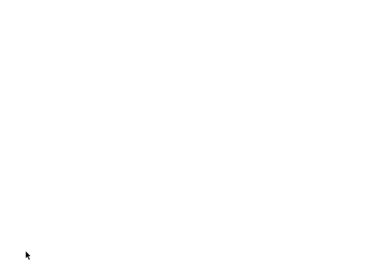

# Nyan

[](https://badge.fury.io/py/nyan)

Nyan - a fork of [Python Play](https://github.com/replit/play) - is an open-source code library for the Python programming language that makes it as easy as possible to start making games. Here's the code to make a simple game using Nyan:

```python
import nyan

cat = nyan.new_text('=^.^=', font_size=70)

@nyan.repeat_forever
async def move_cat():
    cat.x = nyan.random_number(-200, 200)
    cat.y = nyan.random_number(-200, 200)
    cat.color = nyan.random_color()
    
    cat.show()

    await nyan.sleep(seconds=0.4)

    cat.hide()

    await nyan.sleep(seconds=0.4)

@cat.when_clicked
def win_function():
    cat.show()
    cat.text = 'You won!'

nyan.start_program()
```

The code above makes a game where you have to click the cat to win:



Nyan is an excellent choice for beginner programmers to get started with graphics programming. It was designed to have similar commands and simplicity to [MIT's Scratch](https://scratch.mit.edu) and is distinguished from such projects as Pygame, Arcade, or Pygame Zero because of its lack of boiler plate code, its easy-to-understand plain-english commands, and intuitive API.

# How to install Nyan

Make sure that you have Python 3.8 or greater. Run the following command in your terminal:
```
pip install nyan
```

# How to use Nyan

All Nyan programs start with `import nyan` and end with `nyan.start_program()`, like this:

```python
import nyan # this is the first line in the program


nyan.start_program() # this is the last line in the program
```

All other commands go between those two commands.

## Commands

The rest of this document is divided into the following sections:

- [Basic Commands](#basic-commands) - Getting graphics, shapes, and text on the screen. Also changing the backdrop.
- [Animation and Control Commands](#animation-and-control-commands) - Animating and controlling graphics, shapes, and text.
- [Sprite Commands](#sprite-commands) - Controlling sprites.
- [Mouse Commands](#mouse-commands) - Detecting mouse actions (clicks, movement).
- [Keyboard Commands](#keyboard-commands) - Detecting keyboard actions.
- [Audio Commands](#audio-commands) - Playing sounds and music.
- [Other Useful Commands](#other-useful-commands) - General commands.
- [Packaging Nyan Programs](#packaging-nyan-programs) - Creating an executable that can be shared with other people.

## Basic Commands

To get images or text on the screen, use the following commands. (Copy and paste the code below to try it out.)

#### `nyan.new_rect()`
```python
box = nyan.new_rect(
        color='black',
        x=0,
        y=0,
        width=100,
        height=200,
        border_color="light blue",
        border_width=10
    )
```

This will put a tall, black Rectangle in the middle of the screen.

If you want to change where the image is on the screen, try changing `x=0` (horizontal position) and `y=0` (vertical position). Just like Scratch, the middle of the screen is x=0, y=0. Increasing x moves the image right and decreasing x moves the image left. Likeswise, increasing y moves the image up and decreasing y moves the image down. You can also change the color by changing `'black'` to another color name, like `'orange'`.

#### `nyan.new_image()`
```python
character = nyan.new_image(
        image='character.png', 
        x=0, 
        y=0, 
        size=100
    )
```

This will place an image in the middle of the screen. Make sure you have a file named `character.png` in a folder named `assets` inside your project for the code above to work. You can find images online at sites like http://icons.iconarchive.com/icons/icojam/animals/64/01-bull-icon.png, or you can make your own using an online sprite editor like this one https://www.piskelapp.com/.

#### `nyan.new_text()`
```python
greeting = nyan.new_text(
        text='hi there', 
        x=0, 
        y=0, 
        font=None, 
        font_size=50, 
        color='black'
    )
```

This will put some text on the screen.

If you want to change the font, you'll need a font file (usually named something like `Arial.ttf`) in your assets folder. Then you can change `font=None` to `font='Arial.ttf'`. You can find font files at sites like [DaFont](https://www.dafont.com).

#### `nyan.new_circle()`
```python
ball = nyan.new_circle(
        color='black', 
        x=0, 
        y=0, 
        radius=100, 
        border_color="light blue", 
        border_width=10
    )
```

This will put a black circle in the middle of the screen.

#### `nyan.set_backdrop()`
You can change the background color with the `nyan.set_backdrop()` command:

```python
nyan.set_backdrop('light blue')
```

There are [lots of named colors to choose from](https://upload.wikimedia.org/wikipedia/commons/2/2b/SVG_Recognized_color_keyword_names.svg). Additionally, if you want to set colors by RGB (Red Green Blue) values, you can do that like this:

```python
# Sets the background to white. Each number can go from 0 to 255
nyan.set_backdrop((255, 255, 255))
```

Anywhere you can set a color in Nyan, you can do it using a named color like `'red'` or an RGB value above like `(255, 255, 255)` or even an RGBA value like `(0, 0, 0, 127)` (the fourth number is transparency from 0 to 255).

## Animation and Control Commands

#### `@nyan.repeat_forever`
To make things move around, you can start by using `@nyan.repeat_forever`, like this:

```python
cat = nyan.new_text('=^.^=')

@nyan.repeat_forever
def do():
    cat.turn(10)  
```    

The above code will make the cat turn around forever. Sprites have other commands that you can see in the next section called Sprite Commands.

#### `@nyan.when_program_starts`
To make some code run just at the beginning of your project, use `@nyan.when_program_starts`, like this:

```python
cat = nyan.new_text('=^.^=')

@nyan.when_program_starts
def do():
    cat.turn(180)  
```

This will make the cat turn upside down instantly when the program starts.

#### `await nyan.sleep(seconds=1)`
To run code after a waiting period, you can use the `await nyan.sleep()` command like this:

```python
cat = nyan.new_text('=^.^=')

@nyan.when_program_starts
async def do():
    cat.turn(180)  
    await nyan.sleep(seconds=2)
    cat.turn(180)  
```

This will make the cat turn upside down instantly when the program starts, wait 2 seconds, then turn back up again.

#### `nyan.broadcast()`
You can use `nyan.broadcast()` to broadcast an event that can be picked up by an event listener.
```python
@nyan.repeat_forever
def do():
    nyan.broadcast('marco')
```

#### `@nyan.when_event_recieved()`
To run code in response to a broadcasted event, use `@nyan.when_event_recieved()`, like this
```python
@nyan.when_event_recieved('marco')
def do():
    print('polo')
```

#### `@nyan.foreach_sprite()`
attaches a script to each sprite passed or in the case a tag is passed, for each sprite that has the given tag. Should be used in conjunction with `@nyan.repeat_forever` and `@nyan.when_program_starts` decorators. Example:

```python
@nyan.repeat_forever
@nyan.foreach_sprite(player1, player2, player3, player4)
async def animate_player(player):
    next_frame(player)
    await nyan.sleep(player.frameTime)

@nyan.repeat_forever
@nyan.foreach_sprite(tag='player-missile')
async def propel_missile(missile):
    missile.move(25)
```

## Sprite Commands

#### Simple commands

Sprites (images and text) have a few simple commands:

- **`sprite.move(10)`** — moves the sprite 10 pixels in the direction it's facing (starts facing right). Use negative numbers (-10) to go backward.
- **`sprite.move(10, direction=45)`** — moves the sprite 10 pixels at an angle specified by the direction.
- **`sprite.turn(20)`** — Turns the sprite 20 degrees counter-clockwise. Use negative numbers (-20) to turn the other way.
- **`sprite.go_to(other_sprite)`** — Makes `sprite` jump to another sprite named `other_sprite`'s position on the screen. Can also be used to make the sprite follow the mouse: `sprite.go_to(nyan.mouse)`.
- **`sprite.go_to(x=100, y=50)`** — Makes `sprite` jump to x=100, y=50 (right and up a little).
- **`sprite.point_towards(other_sprite)`** — Turns `sprite` so it points at another sprite called `other_sprite`.
- **`sprite.point_towards(x=100, y=50)`** — Turns `sprite` so it points toward x=100, y=50 (right and up a little).
- **`sprite.hide()`** — Hides `sprite`. It can't be clicked when it's hidden.
- **`sprite.show()`** — Shows `sprite` if it's hidden.
- **`sprite.add_tag('car')`** — Adds a tag named `car` to the sprite. Tagging a sprite adds it to a group that can be fetched later by other functions.
- **`sprite.remove_tag('car')`** — removes the `car` tag from the sprite
- **`sprite.clone()`** — Makes a copy or clone of the sprite and returns it.
- **`sprite.remove()`** — Removes a sprite from the screen permanently. Calling sprite commands on a removed sprite won't do anything.

#### Properties

Sprites also have properties that can be changed to change how the sprite looks. Here they are:

- **`sprite.x`** — The sprite's horizontal position on the screen. Positive numbers are right, negative numbers are left. The default is 0.
- **`sprite.y`** — The sprite's vertical position on the screen. Positive numbers are up, negative numbers are down. The default is 0.
- **`sprite.size`** — How big the sprite is. The default is 100, but it can be made bigger or smaller.
- **`sprite.angle`** — How much the sprite is turned. Positive numbers are counter-clockwise. The default is 0 degrees (pointed to the right).
- **`sprite.transparency`** — How see-through the sprite is from 0 to 100. 0 is completely see-through, 100 is not see-through at all. The default is 100.
- **`sprite.brightness`** - How bright or dim the sprite is from -100 to 100. -100 is completely dark, 100 is white. The default is 0.
- **`sprite.is_hidden`** — `True` if the sprite has been hidden with the `sprite.hide()` command. Otherwise `False`.
- **`sprite.is_shown`** — `True` if the sprite has not been hidden with the `sprite.hide()` command. Otherwise `False`.
- **`sprite.left`** — The x position of the left-most part of the sprite.
- **`sprite.right`** — The x position of the right-most part of the sprite.
- **`sprite.top`** — The y position of the top-most part of the sprite.
- **`sprite.bottom`** — The y position of the bottom-most part of the sprite.

Image-sprite-only properties:

- **`sprite.image`** — The filename of the image shown.

Text-sprite-only properties:

- **`text.text`** — The displayed text content.
- **`text.font`** — The filename of the font e.g. 'Arial.ttf'. The default is `None`, which will use a built-in font.
- **`text.font_size`** — The text's size. The default is `50` (pt).
- **`text.color`** — The text's color. The default is black.

Box-sprite-only properties:
- **`box.color`** — The color filling the box. The default is `black`.
- **`box.width`** — The width of the box. The default is `100` pixels.
- **`box.height`** — The height of the box. The default is `200` pixels.
- **`box.border_width`** — The width of the box's border, the line around it. The default is `0`.
- **`box.border_color`** — The color of the box's border. The default is `'light blue'`.

If the box has a border, the box's total width, including the border, will be the width defined by the `width` property.

Circle-sprite-only properties:
- **`circle.color`** — The color filling the circle. The default is `black`.
- **`circle.radius`** — How big the circle is, measured from the middle to the outside. The default is `100` pixels, making a 200-pixel-wide circle.
- **`circle.border_width`** — The width of the circle's border, the line around it. The default is `0`.
- **`circle.border_color`** — The color of the circle's border. The default is `'light blue'`.

If the circle has a border, the circle's total width, including the border, will be the width defined by the `radius` property.

These properties can changed to do the same things as the sprite commands above. For example,

```python
sprite.go_to(other_sprite)

# the line above is the same as the two lines below
sprite.x = other_sprite.x
sprite.y = other_sprite.y
```

You can change the properties to animate the sprites. The code below makes the cat turn around.

```python
cat = nyan.new_text('=^.^=')

@nyan.repeat_forever
def do():
    cat.angle += 1
    # the line above is the same as cat.turn(1)
```

#### Other info

Sprites also have some other useful info:

- **`sprite.width`** — Gets how wide the sprite is in pixels.
- **`sprite.height`** — Gets how tall the sprite is in pixels.
- **`sprite.distance_to(other_sprite)`** — Gets the distance in pixels to `other_sprite`.
- **`sprite.distance_to(x=100, y=100)`** — Gets the distance to the point x=100, y=100.
- **`sprite.is_touching(other_sprite)`** — Returns True if `sprite` is touching the `other_sprite`. Otherwise `False`.
- **`sprite.is_touching(point)`** — Returns True if the sprite is touching the point (anything with an `x` and `y` coordinate). For example: `sprite.is_touching(nyan.mouse)`

## Mouse Commands

Working with the mouse in Nyan is easy. Here's a simple program that points a sprite at the mouse:

```python
arrow = nyan.new_text('-->', font_size=100)

@nyan.repeat_forever
def do():
    arrow.point_towards(nyan.mouse)
```

`nyan.mouse` has the following properties:

- **`nyan.mouse.x`** — The horizontal x position of the mouse.
- **`nyan.mouse.y`** — The vertical y position of the mouse.
- **`nyan.mouse.is_clicked`** — `True` if the mouse is clicked down, or `False` if it's not.
- **`nyan.mouse.is_touching(sprite)`** — Returns `True` if the mouse is touching a sprite, or `False` if it's not.

#### `@sprite.when_clicked`

Probably the easiest way to detect clicks is to use `@sprite.when_clicked`.

In the program below, when the face is clicked it changes for 1 second then turns back to normal:

```python
face = nyan.new_text('^.^', font_size=100)

@face.when_clicked
async def do():
    face.text = '*o*'
    await nyan.sleep(seconds=1)
    face.text = '^.^'
```

#### `@nyan.mouse.when_clicked` or `@nyan.when_mouse_clicked`

To run code when the mouse is clicked anywhere, use `@nyan.mouse.when_clicked` or `@nyan.when_mouse_clicked` (they do the same exact thing).

In the code below, when a click is detected, the text will move to the click location and the coordinates will be shown:

```python
text = nyan.new_text('0, 0')

@nyan.mouse.when_clicked
def do():
    text.text = f'{nyan.mouse.x}, {nyan.mouse.y}'
    text.go_to(nyan.mouse)
```

#### `@nyan.mouse.when_click_released` or `@nyan.when_mouse_click_released`

To run code when the mouse button is released, use `@nyan.mouse.when_click_released` `@nyan.when_mouse_click_released` (they do the same exact thing).

In the code below, the cat can be dragged around when it's clicked by the mouse:

```python
cat = nyan.new_text('=^.^= drag me!')
cat.is_being_dragged = False

@cat.when_clicked
def do():
    cat.is_being_dragged = True

@nyan.mouse.when_click_released
def do():
    cat.is_being_dragged = False

@nyan.repeat_forever
def do():
    if cat.is_being_dragged:
        cat.go_to(nyan.mouse)
```

## Keyboard Commands

#### `nyan.key_is_pressed()`

You can use `nyan.key_is_pressed()` to detect keypresses.

In the code below, pressing the `arrow` keys or `w/a/s/d` will make the cat go in the desired direction.

```python
cat = nyan.new_text('=^.^=')

@nyan.repeat_forever
def do():
    if nyan.key_is_pressed('up', 'w'):
        cat.y += 15
    if nyan.key_is_pressed('down', 's'):
        cat.y -= 15

    if nyan.key_is_pressed('right', 'd'):
        cat.x += 15
    if nyan.key_is_pressed('left', 'a'):
        cat.x -= 15
```

#### `@nyan.when_key_pressed()`

You can use `@nyan.when_key_pressed()` to run code when specific keys are pressed.

In the code below, pressing the `space` key will change the cat's face, and pressing the `enter` key will change it to a different face.

```python
cat = nyan.new_text('=^.^=')

@nyan.when_key_pressed('space', 'enter') # if either the space key or enter key are pressed...
def do(key):
    if key == 'enter':
        cat.text = '=-.-='
    if key == 'space':
        cat.text = '=*_*='
```

#### `@nyan.when_any_key_pressed`

If you just want to detect when any key is pressed, you can use `@nyan.when_any_key_pressed`.

In the code below, any key you press will be displayed on the screen:

```python
text = nyan.new_text('')

@nyan.when_any_key_pressed
def do(key):
    text.text = f'{key} pressed!'
```

#### `@nyan.when_key_released()`

Exactly like `@nyan.when_key_pressed()` but runs the code when specific keys are released.

In the code below, text will appear on screen only if the `up` arrow is pressed.

```python
text = nyan.new_text('')

@nyan.when_key_released('up')
async def do(key):
    text.text = 'up arrow released!'
    await nyan.sleep(seconds=1)
    text.text = ''
```

#### `@nyan.when_any_key_released`

Exactly like `@nyan.when_any_key_pressed` but runs the code when any key is released.

In the code below, the name of the most recently released key will show up on screen.

```python
text = nyan.new_text('')

@nyan.when_any_key_pressed
def do(key):
    text.text = f'{key} key released!''
```

## Audio Commands

#### `nyan.new_sound()`
```python
meow = nyan.new_sound(sound='meow.wav')
```
This will load a sound file with `.wav` extension and makes it ready to be played. This function should be mainly used for sound effects. You can get sounds from this site http://soundbible.com/ or you can generate your own using this tool http://www.bfxr.net/.

#### `meow.play()`
This will play the loaded sound file.
```python
meow = nyan.new_sound(sound='meow.wav')

@nyan.when_key_pressed('space')
def do():
    meow.play()
```

#### `nyan.music.play()`
To play an mp3 file in the background, use `nyan.music.play()`, like this
```python
nyan.music.play('William Tell Overture Finale.mp3', loop=True)
```

#### `await nyan.music.play_until_done()`
This is the same as `nyan.music.play()`, but waits for the music to finish before continuing
```python
@nyan.when_program_starts
async def do():
    await nyan.music.play_until_done('William Tell Overture Finale.mp3')
    print('music has ended')
```

#### `nyan.music.pause()`
Pauses the currently playing music
```python
@nyan.when_program_starts
async def do():
    nyan.music.play('William Tell Overture Finale.mp3')
    await nyan.sleep(seconds=5)
    nyan.music.pause()
```

#### `nyan.music.unpause()`
Resumes the paused music
```python
@nyan.when_program_starts
async def do():
    nyan.music.play('William Tell Overture Finale.mp3')
    await nyan.sleep(seconds=5)
    nyan.music.pause()
    await nyan.sleep(seconds=5)
    nyan.music.unpause()
```

#### `nyan.music.stop()`
Stops the currently playing music
```python
@nyan.when_program_starts
async def do():
    nyan.music.play('William Tell Overture Finale.mp3')
    await nyan.sleep(seconds=5)
    nyan.music.stop()
```

#### `nyan.music.volume`
You can use `nyan.music.volume` to get or set the current volume which ranges from 0 to 100. The default is 100
```python
@nyan.when_program_starts
async def do():
    nyan.music.play('William Tell Overture Finale.mp3')
    await nyan.sleep(seconds=5)
    nyan.music.volume = 70
```

## Other Useful Commands

#### `nyan.screen`

The way to get information about the screen. `nyan.screen` has these properties:

- `nyan.screen.width` - Defaults to 800 (pixels total). Changing this will change the screen's size.
- `nyan.screen.height` - Defaults to 600 (pixels total). Changing this will change the screen's size.
- `nyan.screen.left` - The `x` coordinate for the left edge of the screen.
- `nyan.screen.right` - The `x` coordinate for the right edge of the screen.
- `nyan.screen.top` - The `y` coordinate for the top of the screen.
- `nyan.screen.bottom` - The `y` coordinate for the bottom of the screen.

#### `nyan.get_sprites()`

Returns a list of all the sprites (images, shapes, text) in the program. Takes an optional tag parameter that can be used to get all sprites that have a give tag.

#### `nyan.random_number()`

A function that makes random numbers.

If two whole numbers are given, `nyan.random_number()` will give a whole number back:

```python
nyan.random_number(lowest=0, highest=100)

# example return value: 42
```
(You can also do `nyan.random_number(0, 100)` without `lowest` and `highest`.)

If non-whole numbers are given, non-whole numbers are given back:

```python
nyan.random_number(0, 1.0)
# example return value: 0.84
```

`nyan.random_number()` is also inclusive, which means `nyan.random_number(0,1)` will return `0` and `1`.

#### `nyan.random_color()`

Returns a random RGB color, including white and black.

```python
nyan.random_color()
# example return value: (201, 17, 142)
```

Each value varies from 0 to 255.

#### `nyan.random_position()`

Returns a random position on the screen. A position object has an `x` and `y` component.

```python
text = nyan.text('WOO')
@nyan.repeat_forever
def do():
    text.go_to(nyan.random_position())

    # the above is equivalent to:
    position = nyan.random_position()
    text.x = position.x
    text.y = position.y
```

#### `nyan.new_timer()`
Creates a timer. Useful for keeping track of time and for doing animations.

```python
timer = new_timer()
```

Once a timer is created, it will have the following commands and properties:

- **`timer.reset()`** — resets the timer
- **`timer.seconds`** — time elapsed in seconds since creation or last reset
- **`timer.milliseconds`** — time elapsed in milliseconds since creation or last reset

## Packaging Nyan Programs
Nyan comes with a packager that can be used to create stand-alone executables that can be shared with other people without them having to install Python on their computers. To use it, run the following in your terminal

```
nyan-packager python_file
```

This will create an executable file with other stuff in a dist folder inside your project. You can change the icon of the executable with `-icon icon_file` option.

## What's with all this `async`/`await` stuff? Is this Python?

Yes, this is Python! Python added `async` and `await` as special keywords in Python 3.7. It's part of the [asyncio module](https://docs.python.org/3/library/asyncio.html).

Using async functions means we can use the `await nyan.sleep()` function, which makes some code a lot simpler and appear to run in-parallel, which new programmers find intuitive.

```python
import nyan

cat = nyan.new_text('=^.^=')

# this code block uses async so it can use the 'await nyan.sleep()' function
@nyan.repeat_forever
async def change_bg():
    nyan.set_backdrop('pink')
    await nyan.sleep(seconds=1)

    nyan.set_backdrop('purple')
    await nyan.sleep(seconds=1)

    nyan.set_backdrop('light blue')
    await nyan.sleep(seconds=1)

# this code block doesn't need async because it doesn't have `await nyan.sleep()`
@nyan.repeat_forever
def do():
    cat.turn(1)

nyan.start_program()
```

In the above program, the backdrop will change and the cat will appear to turn at the same time even though the code is running single-threaded.

The `async` keyword isn't necessary to write unless you want to use `await` functions. If you try to use an `await` command inside a non-async function, Python will show you an error like this:

```  
  File "example.py", line 31
    await nyan.sleep(seconds=1)
    ^
SyntaxError: 'await' outside async function
```
To fix that error, just put `async` before `def`.

If you don't understand any of this, it's generally safe to just include `async` before `def`.
